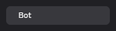
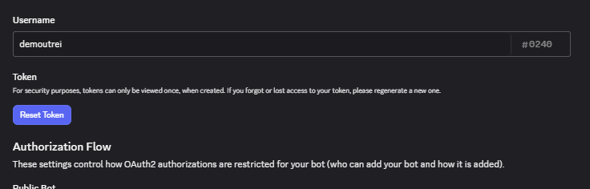

:description: Discord API Frequently Asked Questions.

Frequently Asked Questions
==========================

Discord API Frequently Asked Questions.

How Do I Get A Bot Token?
+++++++++++++++++++++++++

Go to your `Developer Portal`_ in a browser of your choice, and select your desired application. Navigate to your application's **Bot** tab from the left-sidebar.

Just below the bot's username, you'll find a **Token** section. To fetch and copy a bot token, you'll have to click on the ``Reset Token`` button.

.. important::

    Store your bot's token in a secure place, e.g. in a password manager or in a ``.env`` file. **Never, ever, share it to anyone you don't trust. Anyone who has access/stored your bot token can do anything with your bot in their behalf**.

    
    .. admonition:: What To Do If My Bot Token's Leaked/Hacked?
        :class: hint

        Immediately reset your bot's token and store the new one more properly and secured.

.. seealso::

    `Discord API Documentation`_

.. _Discord API Documentation: https://discord.dev
.. _Developer Portal: https://discord.com/developers/applications